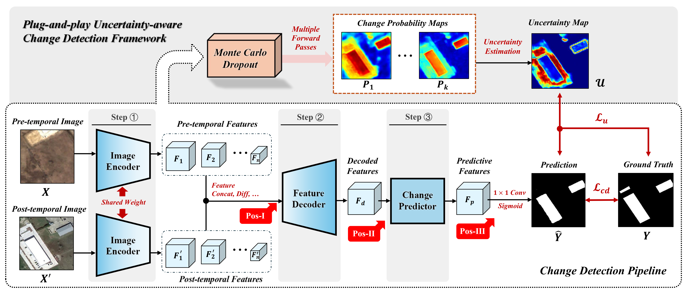
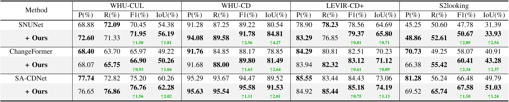
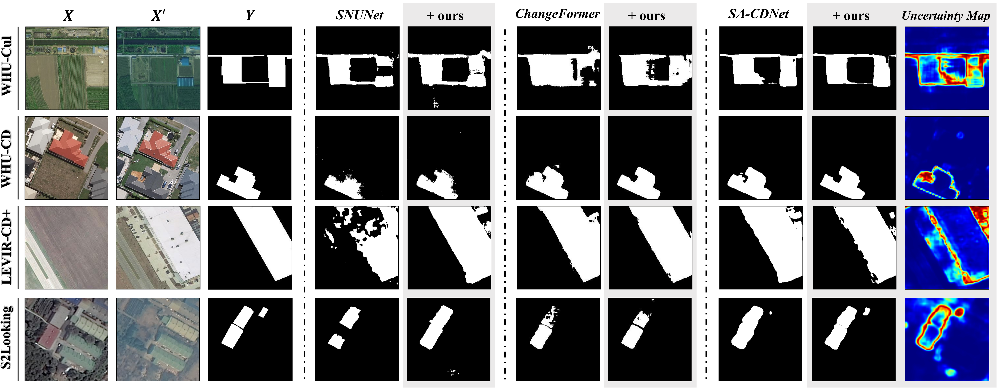

# UACD: A Plug-and-play Framework for Uncertainty-aware Change Detection


## 🔥 News

- **[2026/04/09]**: The relevant code of UACD, as well as the model weights, etc., have all been made open source.
- **[2026/02/06]**: Code cleanup is in progress.
- **[2026/02/05]**: The article "UACD: A Plug-and-play Framework for Uncertainty-aware Change Detection" has been completed.

## :round_pushpin: Todo

- [x]  Release training and inference codes.
- [x]  Provide instructions on dataset preparation and checkpoints.

## :sparkles: Highlight

- **A plug-and-play uncertainty-aware CD framework.** We proposed a Change Detection framwork, which realizes the integration of uncertainty modeling into existing methods with minimal effort.
- **uncertainty-guided regularization term.** We present an uncertainty-guided regularization term for network fine-tuning, which enhances discriminative representations and increases CD performance.
- **Extensive experiments on four challenging benchmarks.** Experiments with three representative methods on four benchmark datasets exhibit the effectiveness and universality of our proposed framework.

## :memo: Introduction

- We proposes a general plug-and-play framework for uncertainty-aware change detection, which can integrate uncertainty modeling into popular CD networks with minimal modifications. Our framework features MC-dropout to induce predictive variations and introduces a regularization term for uncertainty-aware finetuning, which brings consistent increments to baseline models. Comprehensive ablations and experiments on four benchmarks and three baseline models verify the effectiveness and universality of our framework.

  

## :hammer_and_wrench: Install

**Recommended**:  `python=3.9` `torch=1.13.1` `CUDA=11.7`

```shell
# set up repository
git https://github.com/NeyyyyYF/UACD.git
cd UACD

# install conda environment
conda create -n uacd python=3.9
conda activate uacd

pip install -r requirements.txt
```

## :pushpin: Datasets

You can download the pre-processed dataset we have prepared through the following link.

###### The four datasets provided in the links below are all obtained by processing the original datasets. After cropping, the images are all 256*256 resolution.


|   Dataset   |                            Baidu Yun                            | Dataset Category |
| :---------: | :--------------------------------------------------------------: | :--------------: |
|  `WHU-Cul`  | [link](https://pan.baidu.com/s/1uYnO1Ha8pLH98J0SZOG_9A?pwd=a9em) | Change Detection |
|  `WHU-CD`  | [link](https://pan.baidu.com/s/1G-st2GZoHcrfTAY4A4etlA?pwd=8kn5) | Change Detection |
| `LEVIR-CD+` | [link](https://pan.baidu.com/s/1tJ63PCvNAQd4EgzXlCBHCQ?pwd=6yt8) | Change Detection |
| `S2Looking` | [link](https://pan.baidu.com/s/1BZfId7Wk0XraKOV-8SXLBQ?pwd=69t6) | Change Detection |

\> The complete dataset is quite large, so we have also provided a small number of demos for testing in `uacd/demo/`.

## :rocket: Getting Started

\> Here we suppose you are in ` uacd/ `

### File Structure

The whole project is supposed to organized as follows

```shell
# directory
│  README.md
|  requirements.txt
├─checkpoints
│  ├─ChangeFormer
│  │  ├─LEVIR-CD+
│  │  │      best_ckpt.pt 
│  │  ├─S2Looking
│  │  │      best_ckpt.pt   
│  │  ├─WHU-CD
│  │  │      best_ckpt.pt   
│  │  └─WHU-CUL
│  │          best_ckpt.pt
│  ├─SA-CDNet
│  │  ├─LEVIR-CD+
│  │  │      ckp.pth 
│  │  ├─S2Looking
│  │  │      ckp.pth
│  │  ├─WHU-CD
│  │  │      ckp.pth
│  │  └─WHU-CUL
│  │          ckp.pth
│  └─Siam-NestedUNet
│      ├─LEVIR-CD+
│      │      checkpoint.pt 
│      ├─S2Looking
│      │      checkpoint.pt
│      ├─WHU-CD
│      │      checkpoint.pt   
│      └─WHU-CUL
│              checkpoint.pt  
├─datasets
│      README.md
├─uacd
│  ├─ChangeFormer
│  │  │  data_config.py
│  │  │  eval_cd.py
│  │  │  main_cd.py
│  │  │  utils.py
│  │  ├─datasets  
│  │  ├─models   
│  │  └─scripts
│  │
│  ├─SA-CDNet
│  │  │  eval.py
│  │  │  train.py
│  │  ├─datasets  
│  │  ├─fastsam_model
│  │  ├─models
│  │  │  └─SAM_Fusion4.py
│  │  ├─ultralytics  
│  │  └─utils   
│  └─Siam-NestedUNet
│      │  eval.py
│      │  metadata.json
│      │  train.py
│      │  visualization.py
│      ├─models   
│      └─utils  
└─scripts
    ├─ChangeFormer
    │      README.md
    ├─SA-CDNet
    │      README.md
    └─Siam-NestedUNet
            README.md
```

### Download Checkpoints

Here to put the checkpoints of models, which can be downloaded here.

> Download on Baidu cloud disk: [link](https://pan.baidu.com/s/1YVNe7SqdART3aC7NlSndBw?pwd=ujgm) .

### Configure Parameters

Configure the following files.

1. For the SNUNet

```shell
# in ./uacd/Siam_NestedUNet/metadata.json
{
    "patch_size": 256,
    "augmentation": true,
    "num_gpus": 1,
    ...
}

# in ./uacd/Siam_NestedUNet/train.py, line 20
save_path = 'save/path'  

# in ./uacd/Siam_NestedUNet/eval.py, line 18
path = 'path/of/model'   # the path of the model

# in ./uacd/Siam_NestedUNet/visulization.py, line 18
path = 'path/of/model'   # the path of the model
# line 56, the output path
file_path = './output_img/WHU-CD/base/' + base_name + '.png'


```

2. For the ChangeFormer

```shell
# in ./uacd/ChangeFormer/data_config.py, We can configure multiple dataset paths.
if data_name == 'LEVIR':
	self.label_transform = "norm"
	self.root_dir = '/path/to/dataset/root'
# for example
elif data_name == 'DATASET NAME'
	self.label_transform = "norm"
	self.root_dir = '/path/to/dataset'
```

3. For the SA-CDNet

```shell
# for dataset, in ./uacd/SA-CDNet/datasets/data.py, line 16
root = "data/root"

# in ./uacd/SA-CDNet/scripts/run_train.sh
    --working_path "$WORKING_PATH" \
    --DATA_NAME "$DATA_NAME" \
    --NET_NAME "$NET_NAME" \
    ...

# in ./uacd/SA-CDNet/scripts/run_eval.py
    --working_path "$WORKING_PATH" \
    --DATA_NAME "$DATA_NAME" \
    --NET_NAME "$NET_NAME" \
    ...
```

### Start

1. For the SNUNet

```shell
cd ./uacd/Siam-NestedUNet/

# training
python train.py

# evaluation
python eval.py

# visulization
python visualization.py
```

2. For the ChangeFormer

```shell
cd ./uacd/ChangeFormer

sh scripts/run_changeformer_***.sh
```

3. For the SA-CDNet

```shell
cd ./uacd/SA-CDNet/

# training
sh run_train.sh

# evaluation
sh run_eval.sh
```

## :chart_with_upwards_trend: Performance

1. **Quantitative results.**  The performance of the proposed method is evaluated on multiple public datasets. Results are presented in terms of Precision (P), Recall (R), F1-Score (F1) and Intersection over Union (IoU).

   
2. **Qualitative results.**  Visualized comparison of our method with the baseline methods on different datasets.

   

## :bulb: FAQs

- [X]  None
